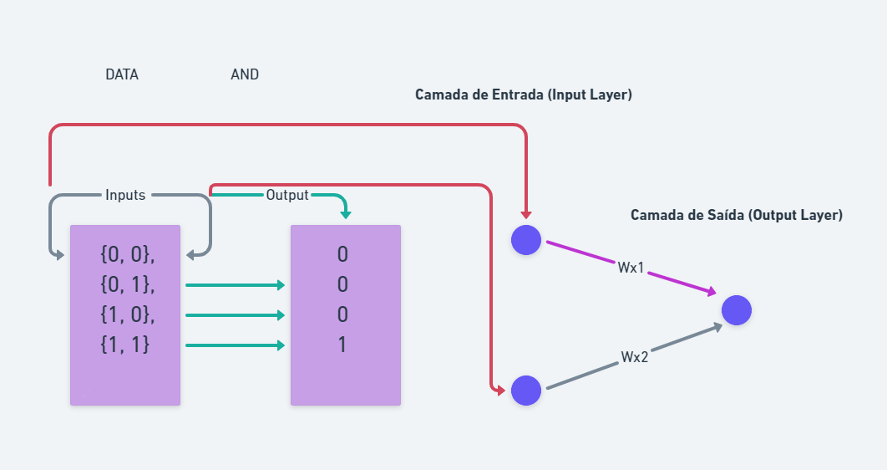

### **O que é**
    Uma rede neural é um modelo computacional inspirado no funcionamento do cérebro humano, projetado para realizar tarefas específicas de aprendizado e reconhecimento de padrões. Ela é composta por unidades chamadas neurônios, organizadas em camadas. As redes neurais podem ser divididas em camadas de entrada, camadas ocultas e camadas de saída.

#### **Funcionamento matemático de uma rede neural:**

- **Entrada (Input):**

Os dados de entrada são representados como um vetor de características.
Cada entrada é multiplicada por um peso correspondente (pesos são parâmetros ajustáveis que a rede aprende durante o treinamento).

- **Somatório Ponderado (Weighted Sum):**

Os produtos das entradas pelos pesos são somados para gerar um valor de ativação para cada neurônio na camada seguinte.
Isso é expresso matematicamente como uma soma ponderada: \[ z = \sum_{i=1}^{n} (w_i \cdot x_i) + b \], 
onde z é o resultado,  w i são os pesos,  x i são as entradas,  n é o número de entradas, e b é o viés (um termo constante que permite ajustar a saída).

- **Função de Ativação:**

Após o somatório ponderado, é aplicada uma função de ativação para introduzir não linearidades na rede.
Funções de ativação comuns incluem a função sigmoide, tangente hiperbólica (tanh), e a unidade linear retificada (ReLU).
A função de ativação introduz não linearidades, permitindo que a rede aprenda padrões mais complexos.

- **Camadas Ocultas (Hidden Layers):**

As camadas entre a entrada e a saída são chamadas de camadas ocultas.
Cada camada oculta realiza o processo de somatório ponderado e aplicação da função de ativação.

- **Saída (Output):**

A camada de saída produz o resultado final da rede neural.
A saída pode ser usada para classificação, regressão ou outras tarefas, dependendo do tipo de problema.

- **Treinamento:**

O treinamento de uma rede neural envolve ajustar os pesos e viés para minimizar a diferença entre as saídas previstas e as saídas reais.
Isso é feito através de um processo chamado retropropagação (backpropagation), onde o gradiente da função de perda em relação aos parâmetros da rede é calculado e usado para ajustar os pesos através de algoritmos de otimização, como o gradiente descendente.
Em resumo, uma rede neural realiza operações matemáticas complexas para aprender padrões e representações a partir de dados de entrada, adaptando seus parâmetros durante o treinamento para realizar tarefas específicas. A escolha das funções de ativação, arquitetura da rede e algoritmo de otimização são elementos essenciais no design e treinamento eficientes de redes neurais.

##### **Explicações extras:**

- **Neurônios e Camadas:**

Neurônios (ou unidades): São unidades básicas que recebem entradas, aplicam transformações a essas entradas e produzem saídas.
Camadas: Neurônios são organizados em camadas, geralmente divididas em três tipos: camada de entrada, camadas ocultas (intermediárias) e camada de saída.

- **Conexões e Pesos:**

Conexões: Neurônios em uma camada estão conectados a neurônios na camada seguinte. Cada conexão representa uma ponderação entre os neurônios.
Pesos: As ponderações ou pesos são valores associados às conexões, indicando a importância da entrada para a saída do neurônio. Durante o treinamento, esses pesos são ajustados para melhorar o desempenho da rede.

- **Função de Ativação:**

Função de Ativação: Cada neurônio aplica uma função de ativação à sua soma ponderada de entradas para determinar sua saída. Essa função adiciona não linearidade à rede, permitindo-a aprender padrões complexos.Exemplos de Funções de Ativação: Sigmoid, Tangente Hiperbólica (tanh), Rectified Linear Unit (ReLU), entre outras.

- **Feedforward:**

Feedforward (Propagação Direta): O processo em que os dados fluem da camada de entrada para a camada de saída, passando pelas camadas ocultas. As saídas são calculadas através das funções de ativação.

- **Treinamento:**

Função de Custo (ou Perda): Mede o quão longe as saídas previstas estão das saídas reais. O objetivo é minimizar essa função durante o treinamento.
Algoritmo de Otimização: Ajusta os pesos da rede para minimizar a função de custo. Exemplos incluem Gradiente Descendente e suas variantes.
Retropropagação (Backpropagation): Calcula os gradientes da função de custo em relação aos pesos, permitindo que o algoritmo de otimização ajuste esses pesos de maneira eficiente.

- **Épocas e Lotes:**

Épocas: Uma época completa ocorre quando a rede neural percorre todos os exemplos de treinamento uma vez.
Lotes (Batch): Em vez de atualizar os pesos a cada exemplo, muitas vezes as redes treinam em lotes de exemplos.
Esses são os conceitos básicos por trás do funcionamento de uma rede neural. O treinamento envolve repetir o processo de feedforward, cálculo de custo, retropropagação e ajuste de pesos até que a rede atinja um desempenho desejado.
